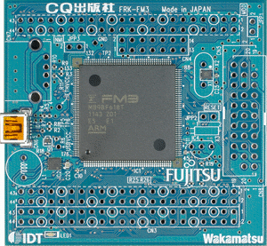

# CQ-FRK-FM3 Board Projects

This repository contains various sample programs for the Fujitsu FM3 (mb9bf61xt) based CQ-FRK-FM3 board.  I'm using it as a means to learn embedded Rust programming from first principles.  

Consider it a work in progress...

